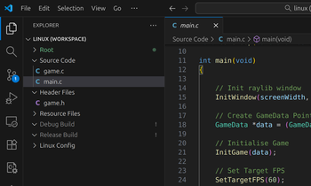
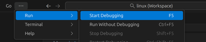
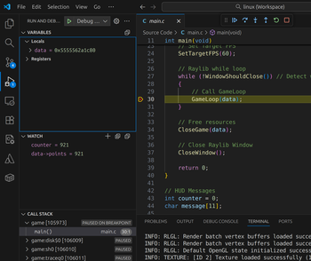
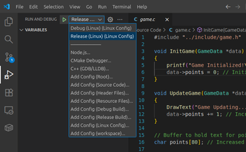
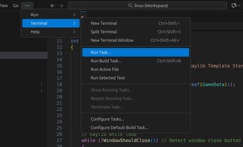
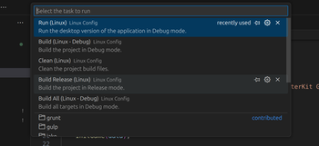
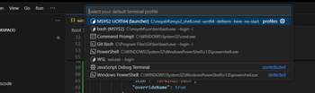

# Raylib Template Guide <a name="raylib-template-guide"></a>

StarterKit for creating new projects using the raylib. This guide walks through the process of setting up a new raylib project.

## Table of Contents

- [Overview](#overview)
- [Quick Start](#initial-setup)
- [Project Structure](#project-structure)
- [Build Commands](#build-configuration)
- [Toolchain Installation](#toolchain-configuration)
	- [Windows MSYS2](#toolchain-windows)
	- [Linux Debian](#toolchain-linux)
	- [MacOS](#toolchain-macos)
- [Workflow](#project-maintenance)
- [Resources](#resources)
- [Support](#support)

## Overview <a name="overview"></a>

This guide provides:

- Step-by-step project initialization
- Repository configuration instructions
- Project structure organization
- Build system customization
- Toolchain installation

## Quick Start<a name="initial-setup"></a>

### 1. Clone template

```bash
git clone https://bitbucket.org/MuddyGames/raylib_project.git my_new_project
cd my_new_project
```

### 2. Setup Repository

Create a new repository on your Git hosting service and name it according to your project (e.g., `my_new_project`)

```bash
git remote set-url origin https://bitbucket.org/YourUsername/my_new_project.git
git push -u origin main
```

### 3. Install Toolchain

```bash
make toolchain
```

### 4. Build and Run

```bash
make build
make run
```

## Project Structure <a name="project-structure"></a>

Organise your project files within the provided structure:
 
```
my_new_project/
├── include/				# Keep project-specific headers in `include`
│   └── game.h				# Game update methods
├── src/					# Your project-specific `src` source files
│   ├── game.c				# Game update implementation
│   └── main.c				# Main entry point
├── resources/				# Maintain assets in `resources` 
│   └── player.png			# Game resources
├── Makefile				# Project-specific build configuration, configure builds in the root `Makefile`
└── README.md				# Project documentation
```

**Guidelines:**

- Source files in `src/`
- Headers in `include/`
- Assets in `resources/`
- Configure builds in root `Makefile`


[](https://mermaid.live/edit#pako:eNqFUk2P2jAQ_SvW9Arp5pM4qvayacMBpKp7W9KDScZgKbGRY0ubIv57nQ9a0FLVp5n33rwnj32GStUIGRw0Ox3J5kcpiTud3U9ACWtkNWryTTTYlTDRw1n7O836Ruy945e9_vz89d2glqwhG7HXTPc_b6TB7sBanIUvtjOqJZPvrEJZT8WH-FdldYUf47e7lgnpVVO2NLon35WQ5ia2mFInSeFKslEHUf03MmeGkVejbWWsvk8t8t1gNCq6UTGaL4lLJqchv3tsv_bJcvlMtnMXPOiKv51XIxcSO2-A8wnfOth291jxAJuvY_oGh1Qumib7hD6POb-jgpninEfo31Lb61DKY6S3TPFvJr_ahRjzGBbuQ4kaMrcjXECL2r2Wa-E8DJVgjthiCZkr3VWZbcyw5YsbOzH5plR7ndTKHo6QcdZ0rrOnmhnMBXNP1f5Btds16hdlpYHMp6MHZGd4hyxKV15Ik1WQxn6cBPECesho4tEooUn6tEoTPwzSywJ-jZlPXkLTKIyi1I1QPw7p5TfO0eyP)

[](https://mermaid.live/edit#pako:eNptUl1vmzAU_SuWn1opiiAwCrxNQZkqrVrVqps08XJrbognYyNjq0uj_PfZEAqke_P9Oufcc32iTFVIc9pwWTXQlpIQrZS5uXmCo-Cv5NmANqjJo1Z_kJnbW99BSANcrtnwHiKyt5IZruSYJOSXw1Rv5AEk1NigNFPpARulj-SrEIrBcuobNEi-K9WSrZJGKzGWfKHPf2baaT_0hLJCzWU9FV7aCgw6JKUrLq-YXu5JoeFtMbBVVvp9r0XXjmBa-F5y4-VMcz7DQfB37HUWYGAqPqMZG8hPEBa7sTboW0JdDKg5m8Mz3ashj4pL082wDRjbkYJ3rYDjmPd7LVEHcwbwH6_-ljOQy_QV-Fao7krbTiNejjfzTCBI2zqKTlnNxu16yw7z63lXnGBtmbF6hupISbug3l1OTApkAnR_uG7p9lLY_4z8bMLHRnRFa80rmjsxuKINaveHXUhPvrmk5uDcLmnunhXuwQpT0lKe3VgL8rdSzTipla0PNN-D6FxkexUFh9p9yI-W3vn-Y9E8i3sImp_oX5pvsmAdZcndlyyIok0QhSt6pHmarLM4yZI0uEuTMNqk5xV97zmDdZKlcRTHcRKGaRgk0fkfBDgiqQ)

[](https://mermaid.live/edit#pako:eNp1UsGO2jAQ_RXLvVWEEggQrJYKCAsrtauq2h7ahIM3GUOkxEa2oy0F_r1jAyl7qCNFnnlv3oyffaS5KoAyGgRBJm1pK2BkxWtIuOXkK9RKH8iXUkB-yCvIpKdlUlTqNd9xbclzkkmCa5bWvKpU3ha_35AgmJJ52qrNHM4tFERJsga-31xK5564SAskBdO9KqU15BPpXeGFh5P0GzeGeBQ0sYqIRua2VNJceYnnLdMfexQC15XUqihFCYY46Te0hzTR_NWTNPDiDWPpGaujR783UpZy-_l8wR4u2CVYueD0E8yJLO8zT-pE1umiUuYyhtAA9w3WXuQxvdqbAL85s3HmOopUFsL0Cf-MPO-AGKdzO3yJPqAZaCTagLX_rPj4oj9MndorzkwM3hCSeJ4DWodci0rtdRirm9w2GtqmaE0XB_O9bzljDxWQGRFlVbF3QsALwD0ybxExgN49srgiEIshTO6R9X_VHm_I0H20Q7e6LCjDSaFDa9A1dyE9upqM4nFqyCjDbQGCN5XNaCbPWLbn8pdS9a1Sq2a7o0zwymDU-AeSlHyred1mNcgC9EI10lIWRqEXoexIf1M2GI26_SgOR_EkGg7C_rBDD5RFcRe3vd541J8MHHDu0D--a68bj6MJrnjSHw_GURSe_wJNChIq)

[](https://mermaid.live/edit#pako:eNpVkcFSgzAQQH8ls2foAAVKc-hFZhxtUQ96EXpYIUBmIGFCsNZO_92QatWcstn3djfJCUpZMaDgum4hNNcdo-RJcqGZIhkKbFjPhC6EzRei7uShbFFp8pwWgph1n5dysvioUfOSvKPi-NaxPXHdDdnmd6JUtshIGJYtqRX2bH-Rd3mFGt3NMHccL0b21-CCvAyGYbe_0tZiD3nKx6HDI6tmas7vpBy-mcwyj_-ZVOHhWgccaBSvgGo1MQd6pnqcQzjN2QJ0a0YogJptxWqcOl1AIc5GG1C8Stn_mEpOTQu0xm400WSnTTk25prXU8VExdTN_FBAw9jWAHqCD6DR0ltEcezHge-tl6vIgSNQP_EXSZD4oRdEySpZe_HZgU_b1NBRFIRGi4P1KvCj0AFWcS1VdvlJ-6HnL_bOliw)


## Build Commands <a name="build-configuration"></a>

The template includes a preconfigured Makefile with the following build targets:

```bash

# Build all targets (desktop)
make all

# Build desktop version
make build

# Rebuild desktop version
# Complete rebuild
make rebuild

# Run desktop version
make run

# Clean build files
make clean

# Build Configurations
make CONFIG=debug			# Debug build (Default)
make CONFIG=release			# Release build

# Install Toolchain
make toolchain

```
## Toolchain Installation <a name="toolchain-installation"></a>

### Windows MSYS2: UCRT64 <a name="windows-msys2"></a>

**Option 1: Automatic Installation**

```bash
make toolchain
```

> **NOTE:** You may need to run this command twice if the package manager is out of date. After updating, restart MSYS2 before running it again.


**Option 2: Manual Installation**

Installation using pacman package manager

```bash
# Update pacman
pacman -Syu

# Install raylib library
pacman -S mingw-w64-ucrt-x86_64-raylib

# Also needed if not installed already
pacman -S mingw-w64-ucrt-x86_64-gcc  # gcc for compiling
pacman -S mingw-w64-ucrt-x86_64-gdb  # gdb for debugging
pacman -S git
pacman -S make
```

> **NOTE:** Always use the UCRT64 terminal in MSYS2, not MINGW64 or MSYS terminals.


### Debian Linux: APT Installation <a name="debian-linux"></a>

```bash

# Run toolchain.sh in Makefile
make toolchain

```

### MacOS: Homebrew Installation <a name="macos"></a>

**Option 1: Automatic Installation**
```bash
# Run toolchain.sh in Makefile
make toolchain
```

**Option 2: Manual Installation**
```bash
# Install Homebrew (if not already installed)
# /bin/bash -c "$(curl -fsSL https://raw.githubusercontent.com/Homebrew/install/HEAD/install.sh)"

# Update Homebrew
brew update

# Install raylib library
brew install raylib

# Also needed if not installed already
xcode-select --install

brew install git
brew install lldb # gdb alternative for MacOS
```

## Development Workflow <a name="project-maintenance"></a>

### Using Visual Studio Code (Workspace)

**Project Layout**

> 

**Debugging**

- Press **`F5`** to start debugging OR access tasks via `Run | Start Debugging`
- Set breakpoints and watch variables in the Debug panel
- Select Debug Configuration `CTRL + Shift + D | Select Debug Config | Debug Build or Release Build`

> 

> 

> 

**Running Tasks**

- Access tasks via `Terminal | Run Task`
- Available tasks include build, run, clean, and rebuild

> 

> 

**Terminal Default**

- Access tasks via `CTRL + Shift + P | Terminal: Select Default Profile`

> 


### Version Maintenance

```bash
git add .
git commit -am "Update project files"
git push origin main
```

## Resources <a name="resources"></a>

### Raylib Documentation
- [Raylib Website](https://www.raylib.com/)
- [Raylib GitHub](https://github.com/raysan5/raylib)
- [Raylib Cheatsheet](https://www.raylib.com/cheatsheet/cheatsheet.html)
- [Raylib Examples](https://www.raylib.com/examples.html)

## Support <a name="support"></a>

For questions and support, contact:

- MuddyGames

[Back to top](#raylib-template-guide)
